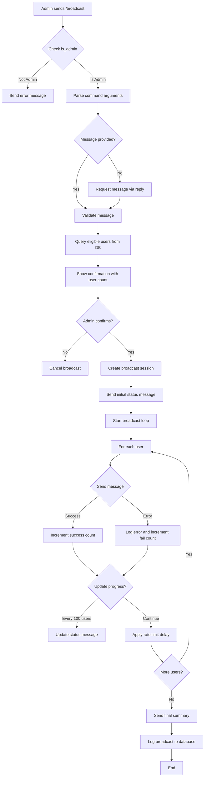

# Broadcast System Architecture Design

## Executive Summary

This document outlines the complete architecture for implementing a broadcast messaging system in the Telegram MovieBot. The system allows administrators to send messages to all eligible users with proper rate limiting, error handling, and progress tracking.

---

## 1. System Overview

### 1.1 Core Requirements
- **Admin-only access** using existing [`is_admin()`](features/user_management.py:22-27) function
- **User targeting** based on terms acceptance and ban status
- **Rate limiting** to comply with Telegram's API limits (~30 messages/second)
- **Progress tracking** with real-time updates to admin
- **Error handling** for blocked users, deleted accounts, and API errors
- **Broadcast history** logging for audit and analytics

### 1.2 Integration Points
- **Command Handler**: [`handle_command()`](features/commands.py:35-126) in [`features/commands.py`](features/commands.py)
- **User Management**: [`is_admin()`](features/user_management.py:22-27), [`log_action()`](features/user_management.py:53-74)
- **Database**: MongoDB [`users_col`](features/database.py:27), new `broadcasts_col`
- **Message Sending**: Hydrogram `client.send_message()`

---

## 2. Architecture Diagram



---

## 3. Command Structure

### 3.1 Command Syntax

```
/broadcast <message>           # Direct message
/broadcast                     # Interactive mode - bot asks for message
```

### 3.2 Command Flow

1. **Admin Check**: Verify user is admin using [`is_admin(user_id)`](features/user_management.py:22-27)
2. **Message Input**:
   - If message provided: Use directly
   - If no message: Use [`wait_for_user_input()`](features/utils.py) to get message
3. **Confirmation**: Show user count and ask for confirmation
4. **Execution**: Start broadcast with progress tracking
5. **Completion**: Show final statistics

### 3.3 Message Support

- **Text messages**: Plain text with Markdown/HTML formatting
- **Media messages**: Photos, videos, documents (future enhancement)
- **Formatting**: Support Telegram's ParseMode (Markdown/HTML)
- **Buttons**: Support inline keyboards (future enhancement)

---

## 4. User Targeting Strategy

### 4.1 Eligible Users Query

```python
# Base query for eligible users
query = {
    "terms_accepted": True,
    "role": {"$ne": "banned"}
}

# Optional: Add activity filter
# query["last_seen"] = {"$gte": datetime.now(timezone.utc) - timedelta(days=30)}
```

### 4.2 User Selection Logic

```python
async def get_broadcast_recipients():
    """Get list of users eligible for broadcast"""
    cursor = users_col.find(
        {
            "terms_accepted": True,
            "role": {"$ne": "banned"}
        },
        {"user_id": 1, "_id": 0}
    )
    users = await cursor.to_list(length=None)
    return [user["user_id"] for user in users]
```

### 4.3 Optional Filters (Future Enhancement)

- **Recently active**: Users active in last N days
- **Premium users**: Target only premium users
- **User segments**: Custom user groups
- **Geographic**: Based on timezone or language

---

## 5. Rate Limiting & Performance

### 5.1 Telegram Rate Limits

- **Global limit**: ~30 messages per second
- **Per-user limit**: 1 message per second to same user
- **Flood wait**: Telegram may impose temporary bans

### 5.2 Rate Limiting Strategy

```python
# Configuration
MESSAGES_PER_SECOND = 25  # Conservative limit (below 30)
DELAY_BETWEEN_MESSAGES = 1.0 / MESSAGES_PER_SECOND  # ~0.04 seconds
PROGRESS_UPDATE_INTERVAL = 100  # Update every 100 users
```

### 5.3 Implementation Pattern

```python
for idx, user_id in enumerate(user_ids, 1):
    try:
        await client.send_message(user_id, message_text)
        success_count += 1
    except Exception as e:
        # Handle errors
        fail_count += 1
    
    # Rate limiting delay
    await asyncio.sleep(DELAY_BETWEEN_MESSAGES)
    
    # Progress update
    if idx % PROGRESS_UPDATE_INTERVAL == 0:
        await update_progress_message(...)
```

### 5.4 Performance Estimates

| Users | Time (25 msg/s) | Time (20 msg/s) |
|-------|-----------------|-----------------|
| 100   | 4 seconds       | 5 seconds       |
| 1,000 | 40 seconds      | 50 seconds      |
| 10,000| 6.7 minutes     | 8.3 minutes     |
| 50,000| 33 minutes      | 42 minutes      |

---

## 6. Error Handling Strategy

### 6.1 Error Categories

1. **User Blocked Bot**: User blocked the bot (common)
2. **User Deleted Account**: Account no longer exists
3. **Flood Wait**: Telegram rate limit exceeded
4. **Network Errors**: Temporary connection issues
5. **Invalid User ID**: User ID doesn't exist

### 6.2 Error Handling Pattern

```python
async def send_broadcast_message(user_id: int, message: str):
    """Send message with comprehensive error handling"""
    try:
        await client.send_message(user_id, message)
        return {"success": True, "user_id": user_id}
    
    except UserIsBlocked:
        # User blocked the bot - silent fail
        return {"success": False, "user_id": user_id, "error": "blocked"}
    
    except PeerIdInvalid:
        # Invalid user ID or deleted account
        return {"success": False, "user_id": user_id, "error": "invalid"}
    
    except FloodWait as e:
        # Rate limit exceeded - wait and retry
        await asyncio.sleep(e.value)
        return await send_broadcast_message(user_id, message)
    
    except Exception as e:
        # Other errors - log and continue
        return {"success": False, "user_id": user_id, "error": str(e)}
```

### 6.3 Error Recovery

- **Continue on failure**: Don't stop broadcast for individual failures
- **Log all errors**: Track error types and frequencies
- **Retry logic**: Retry on FloodWait errors
- **Final report**: Show error breakdown in summary

---

## 7. Progress Tracking System

### 7.1 Progress Message Format

```
📢 BROADCAST IN PROGRESS

📊 Status: Sending...
👥 Total Users: 5,000
✅ Sent: 2,500 (50%)
❌ Failed: 25 (0.5%)
⏱️ Elapsed: 1m 40s
⏳ Estimated: 1m 40s remaining

🔄 Processing...
```

### 7.2 Update Strategy

```python
# Update progress every N users
PROGRESS_UPDATE_INTERVAL = 100

# Track metrics
metrics = {
    "total": len(user_ids),
    "sent": 0,
    "failed": 0,
    "start_time": datetime.now(timezone.utc),
    "errors": defaultdict(int)
}

# Update logic
if idx % PROGRESS_UPDATE_INTERVAL == 0:
    elapsed = (datetime.now(timezone.utc) - metrics["start_time"]).total_seconds()
    rate = metrics["sent"] / elapsed if elapsed > 0 else 0
    remaining = (metrics["total"] - idx) / rate if rate > 0 else 0
    
    await status_msg.edit_text(
        format_progress_message(metrics, elapsed, remaining)
    )
```

### 7.3 Final Summary Format

```
✅ BROADCAST COMPLETED

📊 Final Statistics:
👥 Total Users: 5,000
✅ Successfully Sent: 4,850 (97%)
❌ Failed: 150 (3%)

📉 Error Breakdown:
• User Blocked Bot: 120 (80%)
• Invalid User ID: 25 (16.7%)
• Network Errors: 5 (3.3%)

⏱️ Total Time: 3m 20s
📅 Completed: 2025-01-23 14:30:00 UTC
👤 By: Admin (ID: 123456789)
```

---

## 8. Database Schema

### 8.1 New Collection: `broadcasts_col`

```python
broadcast_document = {
    "_id": ObjectId(),
    "broadcast_id": "bc_20250123_143000",  # Unique identifier
    "admin_id": 123456789,
    "admin_username": "admin_user",
    "message_text": "Important announcement...",
    "message_type": "text",  # text, photo, video, document
    "parse_mode": "Markdown",  # or HTML
    
    # Targeting
    "target_query": {
        "terms_accepted": True,
        "role": {"$ne": "banned"}
    },
    "total_users": 5000,
    
    # Results
    "sent_count": 4850,
    "failed_count": 150,
    "error_breakdown": {
        "blocked": 120,
        "invalid": 25,
        "network": 5
    },
    
    # Timing
    "started_at": datetime(2025, 1, 23, 14, 30, 0),
    "completed_at": datetime(2025, 1, 23, 14, 33, 20),
    "duration_seconds": 200,
    
    # Status
    "status": "completed",  # pending, in_progress, completed, cancelled, failed
    
    # Metadata
    "created_at": datetime(2025, 1, 23, 14, 30, 0)
}
```

### 8.2 Index Requirements

```python
# Create indexes for broadcasts collection
await broadcasts_col.create_index([("broadcast_id", 1)], unique=True)
await broadcasts_col.create_index([("admin_id", 1)])
await broadcasts_col.create_index([("started_at", -1)])
await broadcasts_col.create_index([("status", 1)])
```

### 8.3 Database Updates in [`features/database.py`](features/database.py)

```python
# Add to database.py
broadcasts_col = db["broadcasts"]

# Add to ensure_indexes()
(broadcasts_col, [("broadcast_id", 1)], "broadcast_id index"),
(broadcasts_col, [("admin_id", 1)], "broadcast admin_id index"),
(broadcasts_col, [("started_at", -1)], "broadcast started_at index"),
```

---

## 9. Function Signatures & Implementation Structure

### 9.1 Main Broadcast Function

```python
async def cmd_broadcast(client: Client, message: Message):
    """
    Handle /broadcast command for admin message broadcasting
    
    Args:
        client: Hydrogram client instance
        message: Message object from admin
    
    Flow:
        1. Check admin permission
        2. Get broadcast message (from args or interactive)
        3. Query eligible users
        4. Show confirmation
        5. Execute broadcast with progress tracking
        6. Log results to database
    """
    pass
```

### 9.2 Helper Functions

```python
async def get_broadcast_message(message: Message) -> tuple[str, str]:
    """
    Extract or request broadcast message from admin
    
    Returns:
        tuple: (message_text, parse_mode)
    """
    pass

async def get_broadcast_recipients(filters: dict = None) -> list[int]:
    """
    Query database for eligible broadcast recipients
    
    Args:
        filters: Optional additional filters
    
    Returns:
        list: User IDs eligible for broadcast
    """
    pass

async def send_broadcast_message(
    client: Client,
    user_id: int,
    message_text: str,
    parse_mode: str = None
) -> dict:
    """
    Send message to single user with error handling
    
    Returns:
        dict: Result with success status and error info
    """
    pass

async def execute_broadcast(
    client: Client,
    admin_message: Message,
    user_ids: list[int],
    message_text: str,
    parse_mode: str = None
) -> dict:
    """
    Execute broadcast to all users with progress tracking
    
    Returns:
        dict: Final statistics and results
    """
    pass

async def log_broadcast(
    admin_id: int,
    message_text: str,
    results: dict
):
    """
    Log broadcast to database for history and analytics
    """
    pass

def format_progress_message(
    metrics: dict,
    elapsed: float,
    remaining: float
) -> str:
    """
    Format progress message for status updates
    """
    pass

def format_summary_message(results: dict) -> str:
    """
    Format final summary message
    """
    pass
```

---

## 10. Code Organization

### 10.1 File Structure

**Option 1: Add to existing [`features/commands.py`](features/commands.py)**
- Pros: Keeps all commands in one place
- Cons: File is already large (2300+ lines)

**Option 2: Create new `features/broadcast.py` (RECOMMENDED)**
- Pros: Better separation of concerns, cleaner organization
- Cons: Need to import and integrate

### 10.2 Recommended Structure

```
features/
├── broadcast.py          # NEW: Broadcast system implementation
├── commands.py           # Add cmd_broadcast() that calls broadcast.py
├── user_management.py    # Existing: is_admin(), log_action()
├── database.py           # Update: Add broadcasts_col
└── config.py             # Update: Add broadcast config constants
```

### 10.3 Integration in [`features/commands.py`](features/commands.py)

```python
# Add to imports
from .broadcast import cmd_broadcast

# Add to handle_command() routing (around line 122)
elif command == 'broadcast':
    await cmd_broadcast(client, message)

# Add to ADMIN_HELP (around line 156)
ADMIN_HELP = """
👑 Admin Commands

📢 Broadcasting
/broadcast [message]       - Send message to all eligible users
  • Interactive mode if no message provided
  • Shows progress and statistics
  • Logs all broadcasts for audit

...
"""
```

---

## 11. Testing Strategy

### 11.1 Unit Tests

```python
# tests/test_broadcast.py

async def test_get_broadcast_recipients():
    """Test user query returns correct users"""
    pass

async def test_send_broadcast_message_success():
    """Test successful message send"""
    pass

async def test_send_broadcast_message_blocked():
    """Test handling of blocked user"""
    pass

async def test_rate_limiting():
    """Test rate limiting delays are applied"""
    pass

async def test_progress_tracking():
    """Test progress updates at correct intervals"""
    pass
```

### 11.2 Integration Tests

```python
async def test_broadcast_command_flow():
    """Test complete broadcast flow"""
    pass

async def test_broadcast_with_errors():
    """Test broadcast handles mixed success/failure"""
    pass

async def test_broadcast_cancellation():
    """Test admin can cancel broadcast"""
    pass
```

### 11.3 Manual Testing Scenarios

1. **Small broadcast**: Test with 5-10 test users
2. **Error handling**: Test with blocked/invalid users
3. **Progress updates**: Verify updates appear correctly
4. **Cancellation**: Test cancel functionality
5. **Database logging**: Verify broadcast history is saved

### 11.4 Testing Without Spamming Users

```python
# Test mode configuration
TEST_MODE = os.getenv("BROADCAST_TEST_MODE", "False").lower() == "true"
TEST_USER_IDS = [123456789, 987654321]  # Test user IDs only

if TEST_MODE:
    # Override user query to return only test users
    user_ids = TEST_USER_IDS
else:
    # Normal production query
    user_ids = await get_broadcast_recipients()
```

---

## 12. Configuration Constants

### 12.1 Add to [`features/config.py`](features/config.py)

```python
# Broadcast Configuration
BROADCAST_RATE_LIMIT = int(os.getenv("BROADCAST_RATE_LIMIT", "25"))  # messages per second
BROADCAST_PROGRESS_INTERVAL = int(os.getenv("BROADCAST_PROGRESS_INTERVAL", "100"))  # users
BROADCAST_TEST_MODE = os.getenv("BROADCAST_TEST_MODE", "False").lower() == "true"
BROADCAST_TEST_USERS = [int(x) for x in os.getenv("BROADCAST_TEST_USERS", "").split(",") if x.strip()]
```

### 12.2 Environment Variables

```bash
# .env.bot.example
BROADCAST_RATE_LIMIT=25              # Messages per second (default: 25)
BROADCAST_PROGRESS_INTERVAL=100      # Update progress every N users (default: 100)
BROADCAST_TEST_MODE=False            # Enable test mode (default: False)
BROADCAST_TEST_USERS=123456,789012   # Test user IDs (comma-separated)
```

---

## 13. Optional Features (Future Enhancements)

### 13.1 Scheduled Broadcasts

```python
# Schedule broadcast for later
/broadcast_schedule <datetime> <message>

# Database schema addition
broadcast_document["scheduled_for"] = datetime(2025, 1, 24, 10, 0, 0)
broadcast_document["status"] = "scheduled"
```

### 13.2 Broadcast Cancellation

```python
# Allow admin to cancel in-progress broadcast
# Add cancel button to progress message
buttons = [[InlineKeyboardButton("❌ Cancel Broadcast", callback_data="broadcast_cancel")]]

# Handle cancellation in callback
if callback_data == "broadcast_cancel":
    broadcast_cancelled = True
    # Update status and exit loop
```

### 13.3 User Segmentation

```python
# Target specific user segments
/broadcast --segment premium <message>
/broadcast --segment active_30d <message>
/broadcast --segment new_users <message>

# Segment definitions
SEGMENTS = {
    "premium": {"premium": True},
    "active_30d": {"last_seen": {"$gte": datetime.now() - timedelta(days=30)}},
    "new_users": {"created_at": {"$gte": datetime.now() - timedelta(days=7)}}
}
```

### 13.4 Preview Mode

```python
# Send test broadcast to admin only
/broadcast_preview <message>

# Only send to admin for testing
user_ids = [admin_id]
```

### 13.5 Media Broadcasts

```python
# Support for media messages
async def cmd_broadcast(client, message):
    # Check if message is reply to media
    if message.reply_to_message:
        if message.reply_to_message.photo:
            # Broadcast photo
        elif message.reply_to_message.video:
            # Broadcast video
```

### 13.6 Broadcast History Command

```python
async def cmd_broadcast_history(client, message):
    """Show recent broadcast history"""
    broadcasts = await broadcasts_col.find(
        {"admin_id": message.from_user.id}
    ).sort("started_at", -1).limit(10).to_list(10)
    
    # Format and display history
```

---

## 14. Security Considerations

### 14.1 Access Control

- **Admin-only**: Strictly enforce admin check
- **Rate limiting**: Prevent abuse even by admins
- **Audit logging**: Log all broadcasts with admin ID

### 14.2 Message Validation

```python
# Validate message content
MAX_MESSAGE_LENGTH = 4096  # Telegram limit

if len(message_text) > MAX_MESSAGE_LENGTH:
    return await message.reply_text(
        f"❌ Message too long. Maximum {MAX_MESSAGE_LENGTH} characters."
    )

# Sanitize message (prevent injection)
# Telegram handles this, but validate parse_mode
if parse_mode not in [None, "Markdown", "HTML"]:
    parse_mode = None
```

### 14.3 User Privacy

- **No personal data exposure**: Don't log user messages or personal info
- **Opt-out mechanism**: Users can block bot to stop receiving broadcasts
- **Terms compliance**: Only send to users who accepted terms

---

## 15. Monitoring & Analytics

### 15.1 Metrics to Track

```python
# Broadcast metrics
metrics = {
    "total_broadcasts": 0,
    "total_messages_sent": 0,
    "average_success_rate": 0.0,
    "common_errors": {},
    "average_duration": 0.0
}
```

### 15.2 Analytics Queries

```python
# Get broadcast statistics
async def get_broadcast_stats():
    pipeline = [
        {
            "$group": {
                "_id": None,
                "total_broadcasts": {"$sum": 1},
                "total_sent": {"$sum": "$sent_count"},
                "total_failed": {"$sum": "$failed_count"},
                "avg_duration": {"$avg": "$duration_seconds"}
            }
        }
    ]
    return await broadcasts_col.aggregate(pipeline).to_list(1)
```

### 15.3 Admin Dashboard (Future)

```python
async def cmd_broadcast_stats(client, message):
    """Show broadcast statistics dashboard"""
    stats = await get_broadcast_stats()
    # Format and display stats
```

---

## 16. Implementation Checklist

### Phase 1: Core Functionality
- [ ] Create `features/broadcast.py` module
- [ ] Implement `cmd_broadcast()` function
- [ ] Implement `get_broadcast_recipients()` function
- [ ] Implement `send_broadcast_message()` with error handling
- [ ] Implement `execute_broadcast()` with rate limiting
- [ ] Add command routing in [`handle_command()`](features/commands.py:35-126)
- [ ] Update ADMIN_HELP text

### Phase 2: Progress Tracking
- [ ] Implement progress message formatting
- [ ] Implement progress update logic
- [ ] Implement final summary formatting
- [ ] Test progress updates with various user counts

### Phase 3: Database Integration
- [ ] Add `broadcasts_col` to [`features/database.py`](features/database.py)
- [ ] Create database indexes
- [ ] Implement `log_broadcast()` function
- [ ] Test database logging

### Phase 4: Testing
- [ ] Write unit tests
- [ ] Write integration tests
- [ ] Manual testing with test users
- [ ] Performance testing with large user counts

### Phase 5: Documentation
- [ ] Update README with broadcast command
- [ ] Add inline code documentation
- [ ] Create admin guide for broadcast feature

---

## 17. Risk Assessment & Mitigation

### 17.1 Risks

| Risk | Impact | Probability | Mitigation |
|------|--------|-------------|------------|
| Telegram rate limit ban | High | Medium | Conservative rate limiting, FloodWait handling |
| Large user base timeout | Medium | Low | Progress tracking, async processing |
| Database write failures | Medium | Low | Error handling, retry logic |
| Admin abuse | High | Low | Audit logging, rate limiting |
| Message delivery failures | Low | High | Error tracking, continue on failure |

### 17.2 Mitigation Strategies

1. **Rate Limiting**: Use conservative limits (25 msg/s vs 30 limit)
2. **Error Handling**: Comprehensive try-catch with specific error types
3. **Logging**: Log all broadcasts for audit trail
4. **Testing**: Thorough testing before production deployment
5. **Monitoring**: Track success rates and error patterns

---

## 18. Performance Optimization

### 18.1 Database Query Optimization

```python
# Use projection to fetch only needed fields
cursor = users_col.find(
    {"terms_accepted": True, "role": {"$ne": "banned"}},
    {"user_id": 1, "_id": 0}  # Only fetch user_id
)
```

### 18.2 Batch Processing (Future)

```python
# Process users in batches for very large user bases
BATCH_SIZE = 1000

for i in range(0, len(user_ids), BATCH_SIZE):
    batch = user_ids[i:i + BATCH_SIZE]
    await process_batch(batch)
```

### 18.3 Concurrent Sending (Advanced)

```python
# Use asyncio.gather for concurrent sends (with semaphore)
semaphore = asyncio.Semaphore(25)  # Limit concurrent sends

async def send_with_semaphore(user_id):
    async with semaphore:
        return await send_broadcast_message(user_id, message)

results = await asyncio.gather(*[send_with_semaphore(uid) for uid in user_ids])
```

---

## 19. Deployment Considerations

### 19.1 Pre-Deployment Checklist

- [ ] Test with small user group (< 100 users)
- [ ] Verify rate limiting works correctly
- [ ] Test error handling with blocked users
- [ ] Verify database logging works
- [ ] Test progress updates
- [ ] Review admin permissions

### 19.2 Rollout Strategy

1. **Phase 1**: Deploy to test environment
2. **Phase 2**: Test with admin accounts only
3. **Phase 3**: Test with small user subset (< 100)
4. **Phase 4**: Gradual rollout to all users
5. **Phase 5**: Monitor and optimize

### 19.3 Rollback Plan

- Keep backup of [`features/commands.py`](features/commands.py) before changes
- Document all database schema changes
- Have rollback script ready to remove broadcast command

---

## 20. Success Criteria

### 20.1 Functional Requirements

- ✅ Admin can send broadcast messages
- ✅ Only eligible users receive messages
- ✅ Rate limiting prevents API bans
- ✅ Progress tracking shows real-time status
- ✅ Error handling prevents broadcast failure
- ✅ All broadcasts logged to database

### 20.2 Performance Requirements

- ✅ Send to 1,000 users in < 1 minute
- ✅ Send to 10,000 users in < 10 minutes
- ✅ Success rate > 95% for active users
- ✅ Progress updates every 100 users

### 20.3 Quality Requirements

- ✅ Zero data loss (all results logged)
- ✅ Graceful error handling (no crashes)
- ✅ Clear admin feedback (progress + summary)
- ✅ Audit trail (who sent what when)

---

## 21. Conclusion

This architecture provides a robust, scalable, and maintainable broadcast system for the Telegram MovieBot. The design follows existing code patterns, integrates seamlessly with current infrastructure, and includes comprehensive error handling and monitoring.

### Key Strengths

1. **Follows existing patterns**: Uses same structure as other commands
2. **Comprehensive error handling**: Handles all common failure scenarios
3. **Rate limiting**: Prevents Telegram API bans
4. **Progress tracking**: Keeps admin informed
5. **Audit logging**: Full history of all broadcasts
6. **Extensible**: Easy to add features like scheduling, segmentation

### Next Steps

1. Review this architecture with stakeholders
2. Get approval for implementation approach
3. Switch to Code mode for implementation
4. Follow implementation checklist (Section 16)
5. Test thoroughly before production deployment

---

## Appendix A: Code Examples

### Example 1: Basic Broadcast Implementation

```python
async def cmd_broadcast(client: Client, message: Message):
    """Handle /broadcast command"""
    uid = message.from_user.id
    
    # Check admin
    if not await is_admin(uid):
        return await message.reply_text("🚫 Admins only.")
    
    # Get message
    parts = message.text.split(maxsplit=1)
    if len(parts) < 2:
        # Interactive mode
        prompt = await message.reply_text(
            "📝 Send the message you want to broadcast.\n"
            "Timeout: 60 seconds"
        )
        try:
            response = await wait_for_user_input(message.chat.id, uid, timeout=60)
            message_text = response.text
            await prompt.delete()
        except asyncio.TimeoutError:
            return await prompt.edit_text("⏰ Timeout. Please try again.")
    else:
        message_text = parts[1]
    
    # Get recipients
    user_ids = await get_broadcast_recipients()
    
    # Confirmation
    confirm = await message.reply_text(
        f"📢 **Broadcast Confirmation**
\n"
        f"👥 Recipients: {len(user_ids)} users
"
        f"📝 Message: {message_text[:100]}...
\n"
        f"Reply **YES** to confirm or **NO** to cancel."
    )
    
    try:
        response = await wait_for_user_input(message.chat.id, uid, timeout=30)
        if response.text.upper() != "YES":
            return await confirm.edit_text("❌ Broadcast cancelled.")
    except asyncio.TimeoutError:
        return await confirm.edit_text("⏰ Timeout. Broadcast cancelled.")
    
    # Execute broadcast
    results = await execute_broadcast(client, message, user_ids, message_text)
    
    # Log to database
    await log_broadcast(uid, message_text, results)
```

### Example 2: Execute Broadcast with Progress

```python
async def execute_broadcast(
    client: Client,
    admin_message: Message,
    user_ids: list[int],
    message_text: str
) -> dict:
    """Execute broadcast with progress tracking"""
    
    # Initialize metrics
    metrics = {
        "total": len(user_ids),
        "sent": 0,
        "failed": 0,
        "errors": defaultdict(int),
        "start_time": datetime.now(timezone.utc)
    }
    
    # Send initial status
    status_msg = await admin_message.reply_text(
        format_progress_message(metrics, 0, 0)
    )
    
    # Broadcast loop
    for idx, user_id in enumerate(user_ids, 1):
        # Send message
        result = await send_broadcast_message(client, user_id, message_text)
        
        # Update metrics
        if result["success"]:
            metrics["sent"] += 1
        else:
            metrics["failed"] += 1
            metrics["errors"][result.get("error", "unknown")] += 1
        
        # Rate limiting
        await asyncio.sleep(0.04)  # 25 messages per second
        
        # Progress update
        if