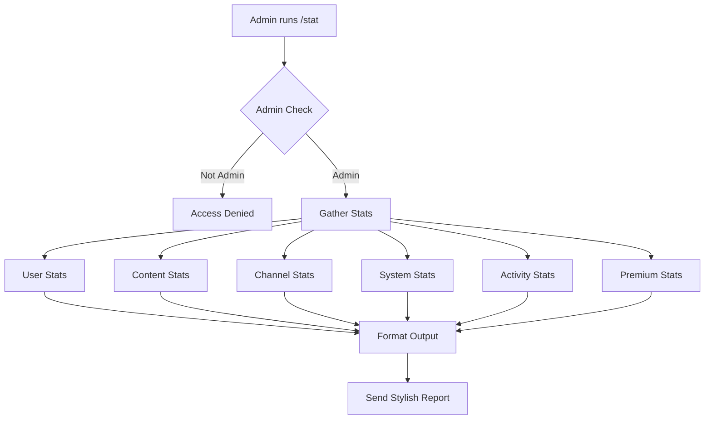

# 📊 /stat Command Feature - Comprehensive Implementation Plan

## 🎯 Overview
Create an admin-only `/stat` command that displays **every possible statistic** the bot can extract, with a stunning, professional output design featuring real-time data, visual charts, and comprehensive metrics.

## 🏗️ Architecture



## 📋 Statistics Categories

### 1️⃣ **User Statistics**
- **Total Users**: Count of all registered users
- **Active Users**: Users active in last 7/30 days
- **New Users**: Sign-ups in last 24h/7d/30d
- **Admin Count**: Total admins
- **Banned Users**: Total banned
- **Premium Users**: Total premium + expiry breakdown
- **User Growth**: Percentage growth rate
- **Search Activity**: Average searches per user
- **Top Users**: Most active users by search count

### 2️⃣ **Content Statistics**
- **Total Files**: All indexed content
- **Movies vs Series**: Count and percentage breakdown
- **Quality Distribution**: 720p, 1080p, 2160p, 4K, etc.
- **Year Distribution**: Content by release year (top 10 years)
- **File Types**: MKV, MP4, AVI breakdown
- **Size Statistics**: Total storage, average file size, largest files
- **Audio Formats**: Distribution of audio codecs
- **Resolution Stats**: Most common resolutions
- **Recent Additions**: Files added in last 24h/7d/30d

### 3️⃣ **Channel Statistics**
- **Total Channels**: Registered channels count
- **Active Channels**: Enabled vs disabled
- **Top Channels**: By file count (top 10)
- **Channel Performance**: Files per channel
- **Indexing Status**: Auto-indexing on/off
- **Channel Growth**: New channels added over time

### 4️⃣ **System Statistics**
- **Database Size**: Estimated total size
- **Collection Sizes**: Per-collection document counts
- **Indexing Stats**: From indexing_stats global
- **Performance Metrics**: Success/error rates
- **Uptime**: Bot running time (if tracked)
- **Memory Usage**: If available from system
- **API Calls**: Rate and success metrics

### 5️⃣ **Activity Statistics**
- **Total Searches**: All-time search count
- **Recent Searches**: Last 24h/7d/30d
- **Top Searches**: Most searched titles (top 15)
- **Search Trends**: Popular queries
- **Request Queue**: Pending requests count
- **Request Stats**: Approved/rejected/pending
- **Command Usage**: Most used commands
- **Download Activity**: If tracked

### 6️⃣ **Premium Statistics**
- **Premium Users**: Total count
- **Expiring Soon**: Premium expiring in 7 days
- **Premium Revenue**: If price tracking exists
- **Feature Usage**: Premium-only feature stats
- **Average Duration**: Average premium subscription length
- **Premium Features**: List of premium-locked features

## 🎨 Output Design Specification

### Visual Elements
```
╔═══════════════════════════════════════════════════════╗
║           📊 BOT STATISTICS DASHBOARD                 ║
║                  Generated: 2025-01-20 14:30 UTC     ║
╚═══════════════════════════════════════════════════════╝

┌─────────────────────────────────────────────────────┐
│ 👥 USER STATISTICS                                   │
├─────────────────────────────────────────────────────┤
│ Total Users:        1,234  [████████░░] 82% Active  │
│ New Today:            12   📈 +15% from yesterday    │
│ Active (7d):       1,012                             │
│ Premium:              45   ⭐ 3.6% of total          │
│ Admins:                3   👑                        │
│ Banned:               18   🚫 1.5%                   │
└─────────────────────────────────────────────────────┘

┌─────────────────────────────────────────────────────┐
│ 🎬 CONTENT STATISTICS                                │
├─────────────────────────────────────────────────────┤
│ Total Files:      45,678                             │
│ Movies:           32,456   [██████████] 71%          │
│ Series:           13,222   [████░░░░░░] 29%          │
│                                                       │
│ Quality Breakdown:                                   │
│ • 4K/2160p:        8,234   [████░░░░░░] 18%          │
│ • 1080p:          28,456   [██████████] 62%          │
│ • 720p:            7,890   [███░░░░░░░] 17%          │
│ • Other:           1,098   [█░░░░░░░░░] 03%          │
│                                                       │
│ Storage:          2.3 TB   (Avg: 52.3 MB/file)       │
└─────────────────────────────────────────────────────┘

┌─────────────────────────────────────────────────────┐
│ 🔥 TOP 10 SEARCHES (Last 7 Days)                     │
├─────────────────────────────────────────────────────┤
│  1. Spider-Man              [████████░░] 847 times   │
│  2. Inception               [███████░░░] 723 times   │
│  3. Breaking Bad            [██████░░░░] 612 times   │
│  ...                                                  │
└─────────────────────────────────────────────────────┘
```

### Format Features
- **Box Drawing Characters**: Use Unicode box-drawing for clean borders
- **Progress Bars**: Visual representation of percentages
- **Emojis**: Category icons for visual appeal
- **Color Formatting**: Using Telegram markdown
- **Number Formatting**: Commas for thousands (1,234)
- **Percentages**: Always show % with context
- **Trends**: Up/down arrows with comparisons
- **Sections**: Clear visual separation

## 🔧 Technical Implementation

### Data Collection Strategy
```python
async def collect_comprehensive_stats():
    """Collect all statistics in parallel for performance"""
    
    # Parallel data collection using asyncio.gather
    user_stats = await collect_user_stats()
    content_stats = await collect_content_stats()
    channel_stats = await collect_channel_stats()
    system_stats = await collect_system_stats()
    activity_stats = await collect_activity_stats()
    premium_stats = await collect_premium_stats()
    
    return {
        'user': user_stats,
        'content': content_stats,
        'channel': channel_stats,
        'system': system_stats,
        'activity': activity_stats,
        'premium': premium_stats,
        'generated_at': datetime.now(timezone.utc)
    }
```

### Key Database Queries

**User Stats:**
```python
total_users = await users_col.count_documents({})
active_users = await users_col.count_documents({
    "last_seen": {"$gte": datetime.now(timezone.utc) - timedelta(days=7)}
})
premium_users = await premium_users_col.count_documents({})
banned_users = await users_col.count_documents({"role": "banned"})
```

**Content Stats:**
```python
# Aggregation for quality distribution
quality_pipeline = [
    {"$group": {"_id": "$quality", "count": {"$sum": 1}}},
    {"$sort": {"count": -1}}
]
quality_dist = await movies_col.aggregate(quality_pipeline).to_list(length=None)
```

**Top Searches:**
```python
# Flatten search history and count
top_searches_pipeline = [
    {"$unwind": "$search_history"},
    {"$group": {"_id": "$search_history.q", "count": {"$sum": 1}}},
    {"$sort": {"count": -1}},
    {"$limit": 15}
]
```

## 🛡️ Security & Performance

### Access Control
- ✅ Admin-only command (check via `is_admin(user_id)`)
- ✅ Log all stat accesses for audit
- ✅ Rate limiting (optional): Max 1 call per minute per admin

### Performance Optimization
- ✅ Use aggregation pipelines for complex queries
- ✅ Limit result sets appropriately
- ✅ Implement caching (optional): Cache stats for 5 minutes
- ✅ Async parallel collection of independent stats
- ✅ Add timeout protection (30s max)
- ✅ Error handling for each stats section

### Error Handling
```python
try:
    stats = await collect_comprehensive_stats()
except asyncio.TimeoutError:
    return "⏰ Stats collection timed out. Try again."
except Exception as e:
    await log_action("stat_error", by=uid, extra={"error": str(e)})
    return "❌ Error collecting stats. Check logs."
```

## 📦 Files to Modify

1. **`features/commands.py`**
   - Add `cmd_stat()` function
   - Register in `handle_command()` router
   - Update `ADMIN_HELP` section

2. **Helper Functions (in commands.py or utils.py)**
   - `collect_user_stats()`
   - `collect_content_stats()`
   - `collect_channel_stats()`
   - `collect_system_stats()`
   - `collect_activity_stats()`
   - `collect_premium_stats()`
   - `format_stats_output()`
   - `create_progress_bar(value, max_value, length=10)`
   - `format_number(num)` - Add commas
   - `format_percentage(part, total)`
   - `format_file_size(bytes)` - Already exists

## 🎯 Success Criteria

- ✅ Command responds in < 10 seconds for large datasets
- ✅ All statistics are accurate and real-time
- ✅ Output is visually appealing and easy to read
- ✅ Proper error handling for all edge cases
- ✅ Admin-only access enforced
- ✅ No crashes with empty/missing data
- ✅ Telegram message length limits respected (split if needed)
- ✅ Logging of all stat accesses

## 🚀 Future Enhancements (Optional)

- Export stats to PDF/CSV
- Historical trend graphs
- Comparison with previous periods
- Alert thresholds (e.g., low storage)
- Scheduled auto-reports to admin channel
- Interactive filters (by date range, channel, etc.)

---

**Priority**: High  
**Complexity**: Medium-High  
**Estimated Implementation Time**: 2-3 hours  
**Dependencies**: MongoDB collections, existing utility functions